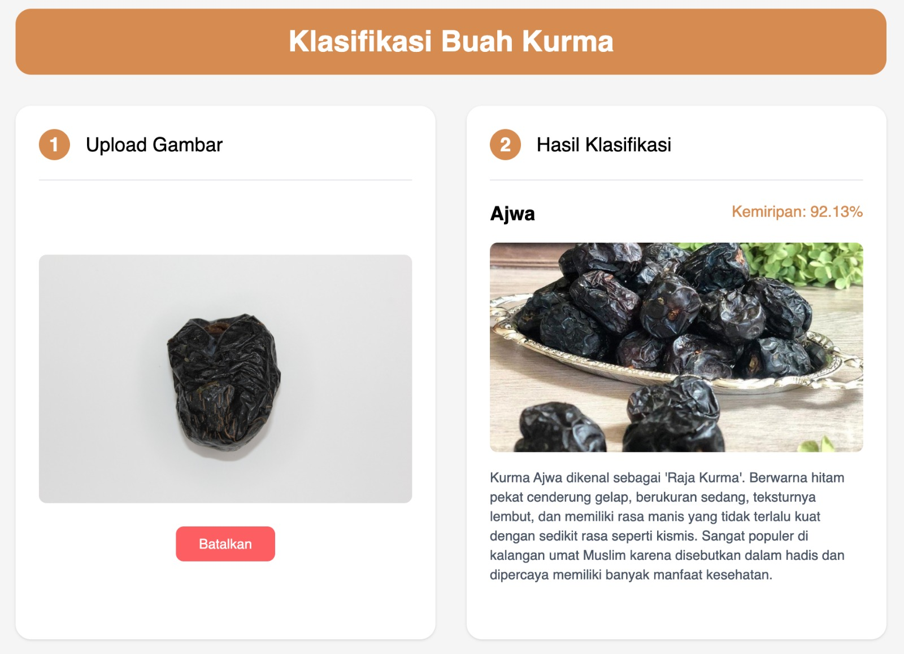

# Date Fruit Classification



Aplikasi klasifikasi buah kurma menggunakan MobileNetV2.

## Tech Stack

- **Frontend**: React.js + Tailwind CSS
- **Backend**: Express.js + TensorFlow.js
- **Model**: MobileNetV2 using TensorFlow

## Instalasi

1. Clone repository
```bash
git clone https://github.com/umarsani1605/date-fruit-classification
```

2. Install dependencies
```bash
# Install dependencies frontend
cd frontend
npm install

# Install dependencies backend
cd ../backend
npm install
```

3. Jalankan aplikasi
```bash
# Jalankan frontend
cd frontend
npm run dev

# Jalankan backend
cd ../backend
npm start
```